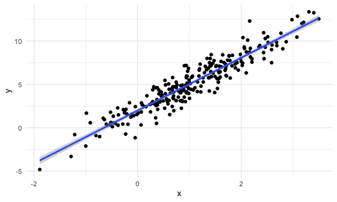
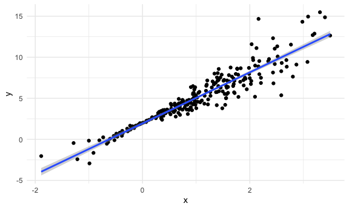
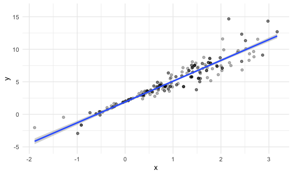
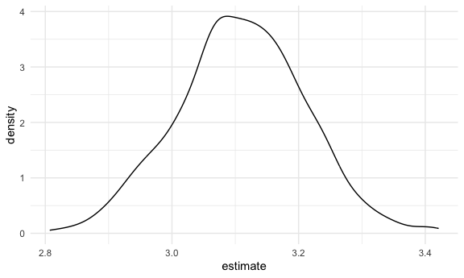

Boostrap
================
Aiying Huang
2023-11-09

``` r
library(tidyverse)
```

    ## ── Attaching core tidyverse packages ──────────────────────── tidyverse 2.0.0 ──
    ## ✔ dplyr     1.1.3     ✔ readr     2.1.4
    ## ✔ forcats   1.0.0     ✔ stringr   1.5.0
    ## ✔ ggplot2   3.4.4     ✔ tibble    3.2.1
    ## ✔ lubridate 1.9.3     ✔ tidyr     1.3.0
    ## ✔ purrr     1.0.2     
    ## ── Conflicts ────────────────────────────────────────── tidyverse_conflicts() ──
    ## ✖ dplyr::filter() masks stats::filter()
    ## ✖ dplyr::lag()    masks stats::lag()
    ## ℹ Use the conflicted package (<http://conflicted.r-lib.org/>) to force all conflicts to become errors

``` r
library(p8105.datasets)

knitr::opts_chunk$set(
  fig.width = 6,
  fig.asp = .6,
  out.width = "90%"
)

theme_set(theme_minimal()+theme(legend.position="bottom"))

options(
  ggplot2.continuous.color="viridis",
  ggplot2.continuous.fill="viridis"
)
scale_colour_discrete=scale_color_viridis_d
scale_fill_discrete=scale_fill_viridis_d

set.seed(1)
```

## simulate data

``` r
n_samp = 250

sim_df_const = 
  tibble(
    x = rnorm(n_samp, 1, 1),
    error = rnorm(n_samp, 0, 1),
    y = 2 + 3 * x + error
  )

sim_df_nonconst = sim_df_const |> 
  mutate(
  error = error * .75 * x,
  y = 2 + 3 * x + error
)
```

plot the datasets

``` r
sim_df_const|>
  ggplot(aes(x=x,y=y))+
  geom_point()+
  geom_smooth(method="lm")
```

    ## `geom_smooth()` using formula = 'y ~ x'



``` r
sim_df_nonconst|>
  ggplot(aes(x=x,y=y))+
  geom_point()+
  geom_smooth(method="lm")
```

    ## `geom_smooth()` using formula = 'y ~ x'



``` r
lm(y~x,data=sim_df_const)|>
  broom::tidy()
```

    ## # A tibble: 2 × 5
    ##   term        estimate std.error statistic   p.value
    ##   <chr>          <dbl>     <dbl>     <dbl>     <dbl>
    ## 1 (Intercept)     1.98    0.0981      20.2 3.65e- 54
    ## 2 x               3.04    0.0699      43.5 3.84e-118

``` r
lm(y~x,data=sim_df_nonconst)|>
  broom::tidy()
```

    ## # A tibble: 2 × 5
    ##   term        estimate std.error statistic   p.value
    ##   <chr>          <dbl>     <dbl>     <dbl>     <dbl>
    ## 1 (Intercept)     1.93    0.105       18.5 1.88e- 48
    ## 2 x               3.11    0.0747      41.7 5.76e-114

## Draw onw boostrap sample

``` r
boot_sample=function(df){
  
  sample_frac(df, replace=TRUE)|>
    arrange(x)
  
}
```

Check if this works…

``` r
boot_sample(sim_df_nonconst)|>
  ggplot(aes(x=x,y=y))+
  geom_point(alpha=.3)+
  geom_smooth(method="lm")+
  ylim(-5,16)
```

    ## `geom_smooth()` using formula = 'y ~ x'



``` r
  lm(y~x,data=boot_sample(sim_df_nonconst))|>
  broom::tidy()
```

    ## # A tibble: 2 × 5
    ##   term        estimate std.error statistic   p.value
    ##   <chr>          <dbl>     <dbl>     <dbl>     <dbl>
    ## 1 (Intercept)     1.90    0.0982      19.3 2.45e- 51
    ## 2 x               3.14    0.0688      45.6 1.18e-122

## Many samples and analysis

``` r
boot_strap=
  tibble(
    strap_number=1:1000,
    strap_sample=map(1:1000, ~ boot_sample(sim_df_nonconst))
  )
```

Can I run my analysis on these…?

``` r
boot_results=
  boot_strap|>
  mutate(
    models=map(.x=strap_sample,~lm(y~x,data=.x)),
    results=map(models,broom::tidy)
  )|>
  select(strap_number,results)|>
  unnest(results)
```

what do I have now?

``` r
boot_results|>
  group_by(term)|>
  summarize(
    mean_est=mean(estimate),
    sd_est=sd(estimate)
  )
```

    ## # A tibble: 2 × 3
    ##   term        mean_est sd_est
    ##   <chr>          <dbl>  <dbl>
    ## 1 (Intercept)     1.93 0.0748
    ## 2 x               3.11 0.101

the actual sd of the slope(0.1\>0.069)

look at the distributions

``` r
boot_results|>
  filter(term=="x")|>
  ggplot(aes(x=estimate))+
  geom_density()
```



Construct boostrap CI

``` r
boot_results|>
  group_by(term)|>
  summarize(
    ci_lower=quantile(estimate,0.025),
    ci_upper=quantile(estimate,0.975)
  )
```

    ## # A tibble: 2 × 3
    ##   term        ci_lower ci_upper
    ##   <chr>          <dbl>    <dbl>
    ## 1 (Intercept)     1.79     2.08
    ## 2 x               2.91     3.31

## Bootstrap using modelr not using the function written by hand

can we simplify anthing…?

``` r
sim_df_nonconst|>
  modelr::bootstrap(1000,id="strap_number")|>
  mutate(
    models=map(.x=strap,~lm(y~x,data=.x)),
    results=map(models,broom::tidy)
  )|>
  select(strap_number,results)|>
  unnest(results)|>
  group_by(term)|>
  summarize(
    ci_lower=quantile(estimate,0.025),
    ci_upper=quantile(estimate,0.975)
  )
```

    ## # A tibble: 2 × 3
    ##   term        ci_lower ci_upper
    ##   <chr>          <dbl>    <dbl>
    ## 1 (Intercept)     1.79     2.08
    ## 2 x               2.92     3.32

``` r
sim_df_const|>
  modelr::bootstrap(1000,id="strap_number")|>
  mutate(
    models=map(.x=strap,~lm(y~x,data=.x)),
    results=map(models,broom::tidy)
  )|>
  select(strap_number,results)|>
  unnest(results) |>
  group_by(term)|>
  summarize(
    mean_est=mean(estimate),
    sd_est=sd(estimate)
  )
```

    ## # A tibble: 2 × 3
    ##   term        mean_est sd_est
    ##   <chr>          <dbl>  <dbl>
    ## 1 (Intercept)     1.98 0.0985
    ## 2 x               3.04 0.0699

works exactly fine
