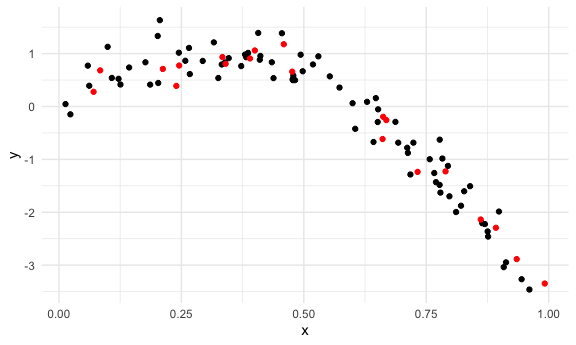
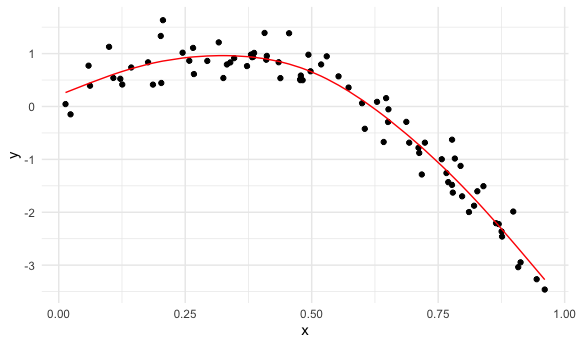
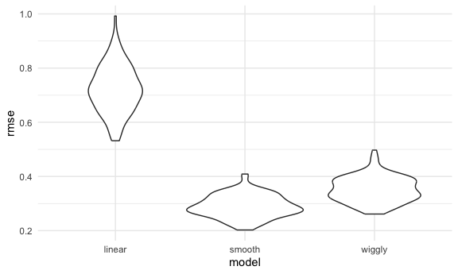

Cross validation
================
Aiying Huang
2023-11-09

``` r
library(tidyverse)
```

    ## ── Attaching core tidyverse packages ──────────────────────── tidyverse 2.0.0 ──
    ## ✔ dplyr     1.1.3     ✔ readr     2.1.4
    ## ✔ forcats   1.0.0     ✔ stringr   1.5.0
    ## ✔ ggplot2   3.4.4     ✔ tibble    3.2.1
    ## ✔ lubridate 1.9.3     ✔ tidyr     1.3.0
    ## ✔ purrr     1.0.2     
    ## ── Conflicts ────────────────────────────────────────── tidyverse_conflicts() ──
    ## ✖ dplyr::filter() masks stats::filter()
    ## ✖ dplyr::lag()    masks stats::lag()
    ## ℹ Use the conflicted package (<http://conflicted.r-lib.org/>) to force all conflicts to become errors

``` r
library(p8105.datasets)

knitr::opts_chunk$set(
  fig.width = 6,
  fig.asp = .6,
  out.width = "90%"
)

theme_set(theme_minimal()+theme(legend.position="bottom"))

options(
  ggplot2.continuous.color="viridis",
  ggplot2.continuous.fill="viridis"
)
scale_colour_discrete=scale_color_viridis_d
scale_fill_discrete=scale_fill_viridis_d

set.seed(1)
```

## Nonlinear data and CV

``` r
nonlin_df=
  tibble(
    id=1:100,
    x=runif(100,0,1),
    y=1-10*(x -.3)^2+rnorm(100,0,0.3)
  )

nonlin_df|>
  ggplot(aes(x=x,y=y))+
  geom_point()
```


DO the train/test split

``` r
train_df=sample_n(nonlin_df,80)
test_df=anti_join(nonlin_df,train_df,by="id")
```

``` r
train_df|>
  ggplot(aes(x=x,y=y))+
  geom_point()+
  geom_point(data=test_df,color="red")
```



``` r
linear_mod=lm(y~x,data=train_df)
```

quick visualization of the linear model

``` r
train_df|>
  modelr::add_predictions(linear_mod)|>
  ggplot(aes(x=x,y=y))+
  geom_point()+
  geom_line(aes(y=pred))
```


load key packages.

``` r
library(tidyverse)
library(modelr)

set.seed(1)
```

``` r
linear_mod = lm(y ~ x, data = train_df)
smooth_mod = mgcv::gam(y ~ s(x), data = train_df)
wiggly_mod = mgcv::gam(y ~ s(x, k = 30), sp = 10e-6, data = train_df)
```

``` r
train_df |> 
  modelr::add_predictions(smooth_mod) |> 
  ggplot(aes(x = x, y = y)) + geom_point() + 
  geom_line(aes(y = pred), color = "red")
```



``` r
train_df |> 
  modelr::add_predictions(wiggly_mod) |> 
  ggplot(aes(x = x, y = y)) + geom_point() + 
  geom_line(aes(y = pred))
```


``` r
train_df |> 
   modelr::gather_predictions(linear_mod, smooth_mod, wiggly_mod) |> 
  mutate(model = fct_inorder(model)) |> 
  ggplot(aes(x = x, y = y)) + 
  geom_point() + 
  geom_line(aes(y = pred), color = "red") + 
  facet_wrap(~model)
```


``` r
rmse(linear_mod, test_df)
```

    ## [1] 0.7052956

``` r
rmse(smooth_mod, test_df)
```

    ## [1] 0.2221774

``` r
rmse(wiggly_mod, test_df)
```

    ## [1] 0.289051

The modelr has other outcome measures – RMSE is the most common, but
median absolute deviation is pretty common as well.

The RMSEs are suggestive that both nonlinear models work better than the
linear model, and that the smooth fit is better than the wiggly fit.
However, to get a sense of model stability we really need to iterate
this whole process. Of course, this could be done using loops but that’s
a hassle …

``` r
cv_df = 
  crossv_mc(nonlin_df, 100) 

cv_df =
  cv_df |> 
  mutate(
    train = map(train, as_tibble),
    test = map(test, as_tibble))
```

``` r
library(tidyverse)
library(modelr)
library(mgcv)
```

    ## Loading required package: nlme

    ## 
    ## Attaching package: 'nlme'

    ## The following object is masked from 'package:dplyr':
    ## 
    ##     collapse

    ## This is mgcv 1.9-0. For overview type 'help("mgcv-package")'.

``` r
set.seed(1)
nonlin_df = 
  tibble(
    id = 1:100,
    x = runif(100, 0, 1),
    y = 1 - 10 * (x - .3) ^ 2 + rnorm(100, 0, .3)
  )

nonlin_df |> 
  ggplot(aes(x = x, y = y)) + 
  geom_point()
```


``` r
cv_df = 
  crossv_mc(nonlin_df, 100) 
```

``` r
cv_df =
  cv_df |> 
  mutate(
    train = map(train, as_tibble),
    test = map(test, as_tibble))
```

``` r
cv_df = 
  cv_df |> 
  mutate(
    linear_mod  = map(train, \(df) lm(y ~ x, data = df)),
    smooth_mod  = map(train, \(df) mgcv::gam(y ~ s(x), data =df)),
    wiggly_mod  = map(train, \(df) gam(y ~ s(x, k = 30), sp = 10e-6, data = df))) |> 
  mutate(
    rmse_linear = map2_dbl(linear_mod, test, ~rmse(model = .x, data = .y)),#clean the output
    rmse_smooth = map2_dbl(smooth_mod, test, ~rmse(model = .x, data = .y)),
    rmse_wiggly = map2_dbl(wiggly_mod, test, ~rmse(model = .x, data = .y)))
```

``` r
cv_df = 
  cv_df |> 
  mutate(
    linear_mod  = map(train, ~lm(y ~ x, data = .x)),
    smooth_mod  = map(train, ~mgcv::gam(y ~ s(x), data = .x)),
    wiggly_mod  = map(train, ~gam(y ~ s(x, k = 30), sp = 10e-6, data = .x))) |> 
  mutate(
    rmse_linear = map2_dbl(linear_mod, test, ~rmse(model = .x, data = .y)),#clean the output
    rmse_smooth = map2_dbl(smooth_mod, test, ~rmse(model = .x, data = .y)),
    rmse_wiggly = map2_dbl(wiggly_mod, test, ~rmse(model = .x, data = .y)))
```

``` r
cv_df
```

    ## # A tibble: 100 × 9
    ##    train             test     .id   linear_mod smooth_mod wiggly_mod rmse_linear
    ##    <list>            <list>   <chr> <list>     <list>     <list>           <dbl>
    ##  1 <tibble [79 × 3]> <tibble> 001   <lm>       <gam>      <gam>            0.674
    ##  2 <tibble [79 × 3]> <tibble> 002   <lm>       <gam>      <gam>            0.813
    ##  3 <tibble [79 × 3]> <tibble> 003   <lm>       <gam>      <gam>            0.700
    ##  4 <tibble [79 × 3]> <tibble> 004   <lm>       <gam>      <gam>            0.705
    ##  5 <tibble [79 × 3]> <tibble> 005   <lm>       <gam>      <gam>            0.705
    ##  6 <tibble [79 × 3]> <tibble> 006   <lm>       <gam>      <gam>            0.701
    ##  7 <tibble [79 × 3]> <tibble> 007   <lm>       <gam>      <gam>            0.572
    ##  8 <tibble [79 × 3]> <tibble> 008   <lm>       <gam>      <gam>            0.813
    ##  9 <tibble [79 × 3]> <tibble> 009   <lm>       <gam>      <gam>            0.759
    ## 10 <tibble [79 × 3]> <tibble> 010   <lm>       <gam>      <gam>            0.693
    ## # ℹ 90 more rows
    ## # ℹ 2 more variables: rmse_smooth <dbl>, rmse_wiggly <dbl>

``` r
cv_df |> 
  select(starts_with("rmse")) |> 
  pivot_longer(
    everything(),
    names_to = "model", 
    values_to = "rmse",
    names_prefix = "rmse_") |> 
  mutate(model = fct_inorder(model)) |> 
  ggplot(aes(x = model, y = rmse)) + geom_violin()
```


